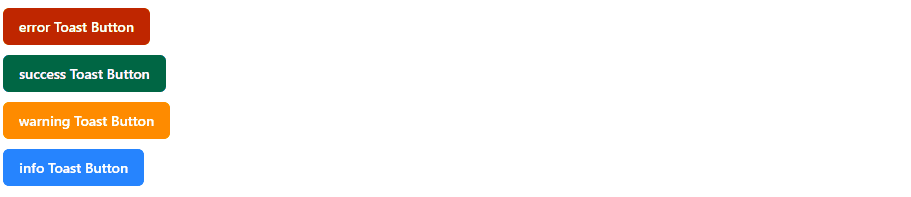

# 🥪 Custom Toast Notification



사용자에게 다양한 유형의 알림 메시지를 띄우기 위한 React 기반 Toast 컴포넌트입니다.  
`Redux`로 상태를 관리하며, `Emotion`, `Storybook`을 활용하여 스타일과 문서화도 함께 제공합니다.

## 🔗 데모 링크

- 🌍 [Toast 미리보기](https://react-toast-notification-eight.vercel.app/)
- 📘 [Storybook 문서 보기](https://parkjooyoung0608.github.io/react-toast-notification/?path=/docs/toast--docs)

알림 컴포넌트를 실제로 확인하고, 다양한 설정을 직접 체험해보세요!

## 🚀 주요 기능

- 다양한 알림 타입 지원 (`success`, `error`, `warning`, `info`)
- 원하는 위치에 배치 가능 (`top-left`, `top-right`, `bottom-left`, `bottom-right`, 등)
- 자동 닫힘(Auto Dismiss) 기능
- 닫기 버튼 표시 여부 설정 가능
- 커스터마이징 가능한 Toast UI
- Storybook으로 컴포넌트 문서화 제공

## 🧱 기술 스택

- React (with TypeScript)
- Redux Toolkit
- Emotion CSS-in-JS
- Storybook
- Vite or CRA (선택에 따라)

## 📦 설치 및 실행

```bash
# 의존성 설치
yarn install

# 개발 서버 실행
yarn dev

# 스토리북 실행
yarn storybook
```

## 🧑‍💻 사용 방법

1. ToastProvider 설정

```tsx
import { Provider } from "react-redux";
import store from "@/Redux/Store";
import Renderer from "@/Components/Toast/Renderer";

function App() {
  return (
    <Provider store={store}>
      <Renderer />
      <YourMainComponent />
    </Provider>
  );
}
```

2. Toast 호출

```tsx
import { useToasts } from "@/Hooks/useToasts";

const { addToast } = useToasts();

addToast("성공적으로 저장되었습니다.", {
  appearance: "success",
  autoDismiss: true,
  placement: "top-right",
  showCloseButton: true,
});
```

## 📌 커스텀 옵션

| 옵션명            | 설명                              | 타입                                                              | 필수 여부 | 기본값        |
| ----------------- | --------------------------------- | ----------------------------------------------------------------- | --------- | ------------- |
| `content`         | Toast에 표시될 메시지 내용        | `ReactNode`                                                       | ✅        | -             |
| `appearance`      | 알림창 스타일 지정 (`success` 등) | `"success"`, `"error"`, `"warning"`, `"info"`                     | ✅        | -             |
| `placement`       | 알림창이 표시될 위치              | `"top-right"`, `"top-left"`, `"bottom-right"`, `"bottom-left"` 등 | ✅        | `"top-right"` |
| `autoDismiss`     | 일정 시간 후 자동으로 닫힐지 여부 | `boolean`                                                         | ❌        | `false`       |
| `showCloseButton` | 닫기 버튼을 표시할지 여부         | `boolean`                                                         | ❌        | `true`        |

## 🛠 커스터마이징 팁

- `StyleConfig/Appearances.ts`를 수정하면 각 타입별 색상 및 아이콘을 커스터마이징할 수 있습니다.
- `StyleConfig/Placements.ts`를 통해 Toast의 위치 설정을 확장할 수 있습니다.
- `Controller.tsx`에서 애니메이션 시간, stack 제한 등을 조정할 수 있습니다.

## 🚧 향후 개선 예정

- 유닛 테스트, E2E 테스트 추가
- Storybook 테스트 추가
- 다크 모드 지원
- ARIA 접근성 속성 강화
- 동일 위치 Toast 스택 개수 제한
